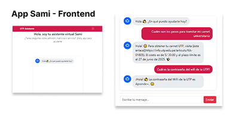
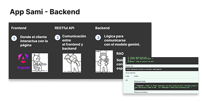

# 📚 Sami – Asistente Virtual para Atención al Estudiante

**Sami** es una aplicación web desarrollada para mejorar la atención al estudiante universitario, reduciendo tiempos de espera y resolviendo dudas frecuentes de manera inmediata mediante una interfaz conversacional.

---

## 📷 Capturas de Pantalla

---

## 🚀 Descripción del Proyecto

Desarrollé esta app como respuesta a un problema que viví: **tiempos de espera innecesarios en la atención al estudiante**. Con **Angular** para el frontend, **FastAPI** para el backend y un modelo de lenguaje (Gemini), creé un asistente virtual capaz de responder preguntas frecuentes en tiempo real.

El mayor logro fue convertir una necesidad real en una solución funcional, aplicando todo lo aprendido en el taller de Angular y viendo el impacto de una solución bien pensada en un contexto real.

---

## 🛠️ Tecnologías Utilizadas
- **Frontend:** Angular
- **Backend:** FastAPI (Python)
- **IA/Modelo conversacional:** Gemini
- **Entorno de desarrollo:** Firebase Studio

---

## Link del backend

https://github.com/miguelmallquidiaz/backend_asistente_ia 